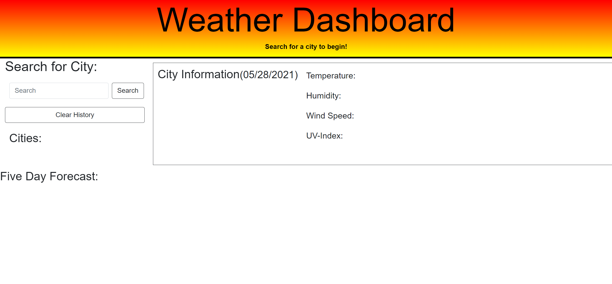
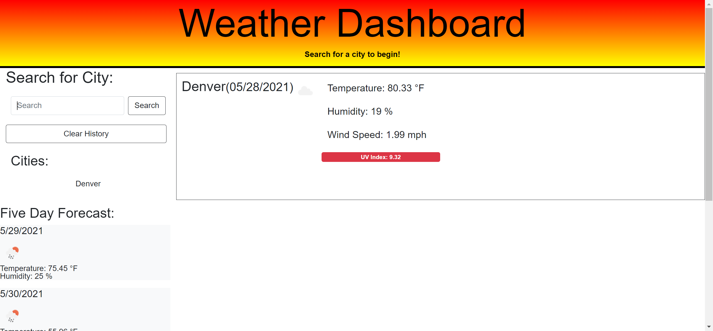

# Weather-Dashboard-SMM

This project is a homework assignment for Rutgers Coding Bootcamp.

## Deploy

[github page site] https://imaparadox.github.io/Weather-Dashboard-SMM/

## Description 
When the user searches for a city, they are presented with current and future conditions for that city. Consequently, the city entered is added to the search history. The user is presented with the city name, the date, an icon representing weather conditions, the temperature, the humidity, the wind speed, and the UV index. When the user views the UV index, the color changes depending on what the condition is (favorable, moderate, or severe). After the user enters a city in the input bar, a 5-day weather forecast is displayed, which lists the date, an icon (weather conditions), the temperature, the humidity, and the wind speed. Finally, the user can click on past-entered cities, which will display information of the selected city.

## Without Content

## With Content

## Notes
I wasn't able to have the 5 day forecast be displayed whenever the user would click any of the list items for the city results. In addition, I wasn't able to figure out how to remove the certain appended elements, in which duplicate information would be displayed. I plan to fix this at a later date.

## Licenses
N/A

## Acknowledgments for advice and assistance:
N/A